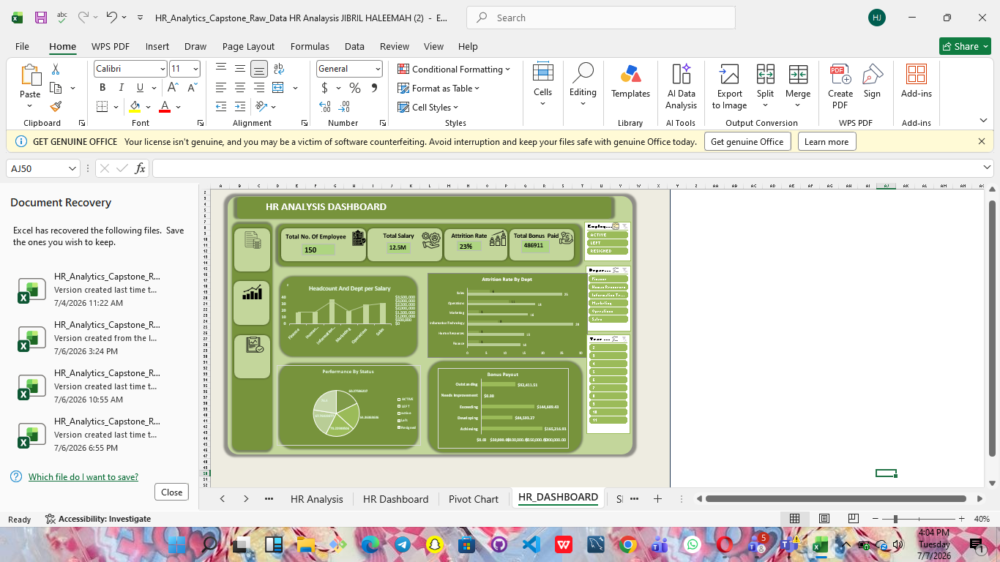

## HR Analytics Project

 ## Project Overview

For this project, I worked with an HR dataset to understand employee distribution, salary structure, and attrition rate across different departments.

The goal was to clean the data properly, analyze it, and create insights that can help the company make better decisions, especially around employee retention.

 ## Data Cleaning Process

## Initial Observation

When I first opened the dataset, it looked quite organized and well arranged, but I didn’t assume it was clean. From what I’ve learned, most datasets usually have small hidden issues that can affect analysis if not handled properly.

After looking through it, I started to notice some inconsistencies like;

## Issues I Found
	
  .	Some columns had blank / missing values,
	•	There were inconsistent formats, especially in date-related columns and also in salary too,
	•	Some text fields had extra spaces,
	•	I also considered the possibility of duplicate records.

## What I Did to Clean the Data

## 1. Handling Missing Values

I used filters to check for blank cells in important columns.
	•	I filled in missing values,using fill up,
	•	In some cases, I use the average of the column to fill in the blanks,especially for numerical data.i chose this method because it helps maintain balance in the dataset without removing useful information. 
  

## 2. Fixing Inconsistencies column

I noticed some columns were not properly formatted.
	•	I standardized the format to make the data consistent
	•	This helped prevent errors during analysis.

## 3. Cleaning Text (Removing Spaces)

Some text columns had extra spaces.
	•	I used functions like TRIM to clean them
	•	This helped ensure proper grouping in pivot tables

## 4. Checking for Duplicates

I checked if any records were repeated.
	•	Removed duplicates where necessary
	•	This ensured my counts (like total employees) were accurate

## 5. Validating Important Columns

I added new column to the dataset like:
	•	Department Name
	•	performance Band
	•	Attrition Rate

I made sure values were consistent and correctly labeled.

## Steps I Followed
	• Checked for missing vaues 
    • I fixed fomarting issues
	• I cleaned text field
	• I added some new columns 
	• I removed duplicates

## Assumptions I Made
	-	Blank values were treated as fill up, not zero
	-	Attrition values were assumed to be correctly labeled as “YES” or “NO”
	-	Salary values were in the same currency

## Challenges I Faced

At some point, some formatting changes didn’t apply immediately, which confused me a bit.

Also, deciding how to handle missing values required some thinking because I didn’t want to affect the accuracy of the data.

To solve this, I kept rechecking the data using filters and sorting until I was confident.

## Final Outcome of Cleaning

After cleaning, the dataset became more consistent and reliable, which made it easier to create pivot tables and dashboards without errors.

📊 Data Analysis & Insights

## 1. Employee Distribution

I noticed that the company has about 150 employees in total.

Information Technology has the highest number of employees, while Finance and HR have fewer employees.

This shows the company focuses more on technical roles.

## 2. Salary Analysis

The total salary is around $12.5M, and it is not evenly distributed.

I found that IT, Sales, and Operations take a larger share of the salary.

This makes sense since these departments are likely more involved in core operations and revenue generation.

## 3. Attrition Rate

One thing that really stood out to me is the attrition rate, which is 23% overall.

When I broke it down:
	•	Operations has the highest attrition
	•	IT also has noticeable attrition
	•	HR has the lowest

Honestly, I didn’t expect Operations to be that high at first, but it clearly shows there might be issues in that department.

## 4. Performance & Bonus

I noticed that employees with higher performance ratings receive higher bonuses.

This shows that the company rewards performance, which is good, but it might also put pressure on some employees.

## Recommendations

Based on what I found:
	•	The company should focus on reducing attrition in Operations
	•	There may be issues like workload or job satisfaction
	•	Introduce employee engagement strategies
	•	Continue rewarding high performance but also support average performers
	•	Conduct regular employee feedback surveys

## Conclusion

From this project, I learned that data cleaning is a very important step before analysis. At first, the dataset looked fine, but after working on it, I realized there were several small issues that could have affected my results.

Also, the analysis showed that while the company is doing well in some areas, employee retention is a major concern, especially in certain departments.

## Tools Used
	•	Microsoft Excel
	•	Pivot Tables
	•	Pivot Charts
	•	Dashboard Design 

 Final Note

This project helped me understand how data can reveal important insights that are not obvious at first glance. It also improved my confidence in using Excel for real analysis.
